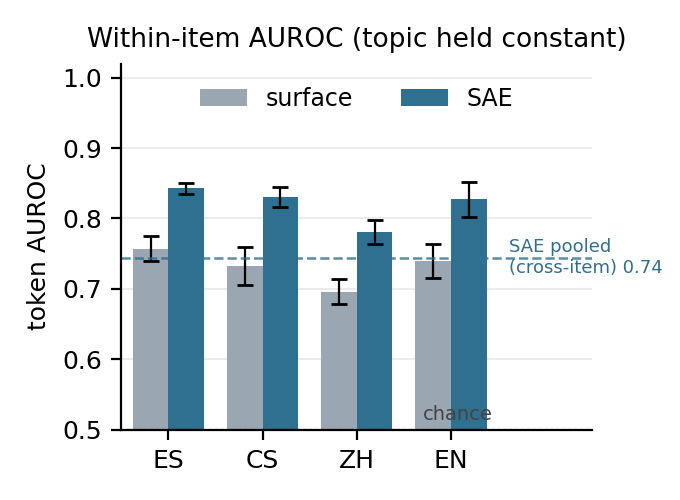
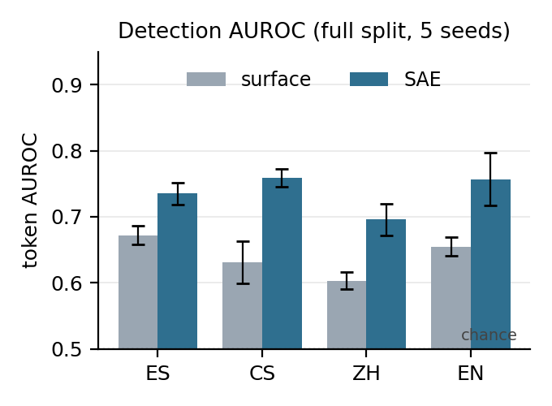

# White-Box Hallucination Detection on Multilingual Mu-SHROOM

A token-level hallucination detector built from **sparse-autoencoder (SAE) features** over a
transformer's residual stream, evaluated on **Mu-SHROOM (SemEval-2025 Task 3)** in Spanish,
Czech, Mandarin, and English.

**The claim, stated carefully:** a white-box signal genuinely detects hallucination at the token
level, multilingually — and it is *validated against both a surface-form control and a topic
control* (a within-item AUROC that most of the literature skips). The signal is real; the
surface confound is real and under-reported; and the controls that separate them are the
methodological core of the project.

---

## TL;DR

- **It works:** SAE probe token-AUROC **0.745 ± 0.012** (full split, 5 seeds).
- **Most of it is surface confound:** a trivial 12-feature surface baseline reaches **0.698** —
  ~80% of the above-chance signal. *This is the control the field usually omits.*
- **But a real signal survives:** the **within-item AUROC is 0.818 ± 0.011** — inside a single
  answer, where topic/language/generator are fixed, the probe still separates hallucinated from
  faithful tokens, ~0.09 above the surface control, **in all four languages**. That cannot be
  surface or topic confound.
- **Span IoU:** 0.396 vs a FLAG-ALL floor of 0.313 (clears the floor in all 4 languages; UCSC
  reference ≈ 0.55 — the remaining gap is a span-extraction problem, not a signal problem).
- **Honest negatives:** claim-type routing, an internal-vs-external "gap", and proxy retrieval
  all add nothing. They are reported, not hidden.



*The decider: within an answer (topic held constant), the SAE probe (dark) beats a surface
control (grey) in every language and sits above the pooled cross-item score (dashed) — evidence
the signal is token-level, not topic.*

---

## Documentation map

This repo is meant to be read alongside three companion documents. Start wherever fits your
question:

| Document                           | What it is                                   | Read it for                                                                                                                           |
|------------------------------------|----------------------------------------------|---------------------------------------------------------------------------------------------------------------------------------------|
| **[`proposal.md`](proposal.md)**   | The thesis proposal                          | Problem statement, approach, findings, contributions, caveats, and remaining timeline                                                 |
| **[`decisions.md`](decisions.md)** | A dated decision log (D0 → D6)               | *Why* the project is shaped this way — the pivots from TRACE+SAGE to the validated probe, and why each elaboration was kept or killed |
| **[`paper.tex`](paper.tex)**       | A self-contained IEEE conference paper draft | The formal write-up; compiles on Overleaf with pdfLaTeX (needs `figs/fig_detection.pdf` and `figs/fig_within.pdf`)                    |
| **this `README.md`**               | Project overview + how to run                | Getting oriented and reproducing the numbers                                                                                          |

The short version of the story (full version in [`decisions.md`](decisions.md)): the project
began as a routed, multi-verifier architecture (TRACE + SAGE), but the pilot killed the
elaborations one by one and converged on a simpler, stronger result — a plain SAE-feature probe
whose signal *survives the controls that would otherwise explain it away*. An early, under-powered
confound read briefly suggested the signal was pure artifact (D5); the full-split, 5-seed
re-run overturned that and established the genuine signal (D6).

---

## The idea in one diagram

```
   answer tokens  (es / cs / zh / en)
              |
   Gemma-2-2b   resid_post  layer 12
              |
   Gemma Scope SAE   (16,384 features)
              |
   frequency filter  (>= 0.5% of tokens)
              |
   per-token logistic probe
              |
   token hallucination scores
        /            |            \
  surface        pooled        within-item
  baseline       AUROC          AUROC
  (form)        (overall)      (topic control)
```

A detector is cheap; the contribution is the **gauntlet of controls** around it. The surface
baseline asks "how much is just form?"; the within-item AUROC asks "does anything survive once
topic is held constant?". Only a signal that clears both is reported as real.

---

## Results

**Detection (full split, 5 seeds).** The SAE probe leads a surface baseline in every language
with non-overlapping error bars.

| Feature set           |       Token-AUROC |
|-----------------------|------------------:|
| Surface (12 features) |     0.698 ± 0.026 |
| SAE, full             | **0.745 ± 0.012** |



**Within-item control (the decider).** Topic, language, and generator are constant inside an item,
so this cannot be a confound.

| Setting                  |       Token-AUROC |
|--------------------------|------------------:|
| SAE, pooled (cross-item) |     0.744 ± 0.011 |
| Surface, within-item     |     0.730 ± 0.013 |
| **SAE, within-item**     | **0.818 ± 0.011** |

**Span-level IoU (full split, 5 seeds, per-language threshold).**

|                |      Mean |    es |    cs |    zh |    en |
|----------------|----------:|------:|------:|------:|------:|
| FLAG-ALL floor |     0.313 | 0.180 | 0.246 | 0.474 | 0.325 |
| SAE probe      | **0.396** | 0.312 | 0.364 | 0.476 | 0.423 |

**Negatives (reported, not hidden).** Routing per-route AUROC is flat (Rel 0.780 / Ext 0.791 /
Subj 0.708; routing κ = 0.725); the gap adds nothing (SAE+gap 0.769 ≈ SAE 0.770); REFIND
retrieval sits at chance (CSR 0.502); SAE features are at parity with raw residuals (0.770 vs
0.773), so interpretability costs no accuracy.

Full per-language tables are in [`proposal.md`](proposal.md) §3 and reproduced in
[`paper.tex`](paper.tex) (Appendix).

---

## Repository layout

Flat by design — no `lib/` vs `experiments/` split, to keep the pilot fast to navigate.

**Library (the reusable substrate)**
- [`config.py`](config.py) — central config: backbone, layer, SAE id, sample sizes, seeds
- [`data.py`](data.py) — load the Mu-SHROOM test parquets per language
- [`wb.py`](wb.py) — model load, tokenize + char offsets, residual capture, log-probs, token labels, span merge
- [`features.py`](features.py) — SAE load/encode + **on-disk cache** of the backbone forwards (float16)
- [`probe.py`](probe.py) — train / predict / **per-language threshold calibration**
- [`metrics.py`](metrics.py) — character-level IoU (the Mu-SHROOM metric) and floors
- [`llm_client.py`](llm_client.py), [`decompose_route.py`](decompose_route.py) — claim decomposition + routing + span anchoring (the explanation layer)

**Experiments**
- [`iou_eval.py`](iou_eval.py) — detection: probe vs floors, AUROC, IoU (full split, per-language calibrated)
- [`confound_check.py`](confound_check.py) — **surface baseline vs SAE probe** (the surface control)
- [`within_item.py`](within_item.py) — **within-item AUROC** (the topic control — the decider)
- [`feature_analysis.py`](feature_analysis.py) — which SAE features the probe relies on
- [`trace.py`](trace.py) — ablation: routing does not help
- [`sage.py`](sage.py) — ablation: SAE == raw residuals; the gap shows no lift
- [`deloitte_probe.py`](deloitte_probe.py), [`refind.py`](refind.py), [`baseline_trivial.py`](baseline_trivial.py) — baselines
- [`label_routes.py`](label_routes.py), [`score_vs_claude.py`](score_vs_claude.py) — routing-agreement (κ)
- [`make_figs.py`](make_figs.py) — regenerate `figs/fig_detection.*` and `figs/fig_within.*`

**Checks & tooling**: `check_mps_fidelity.py` (verify MPS == CPU for the backbone), `smoke_test.py`, `setup_mac.sh`

**Docs & outputs**: [`proposal.md`](proposal.md), [`decisions.md`](decisions.md),
[`paper.tex`](paper.tex), `figs/` (result figures), `runs/` (outputs + feature cache)

---

## Getting started

**Environment.** Python 3.11. Developed on Apple Silicon (M4 Max, 64 GB, MPS); CUDA works too.
A Hugging Face login is needed for Gemma-2 / Llama weights, and Ollama (or any OpenAI-compatible
endpoint) for the decomposition/routing layer.

```bash
python -m venv .venv && source .venv/bin/activate
pip install -r requirements.txt        # transformer-lens, sae-lens, scikit-learn, numpy, pandas
huggingface-cli login                  # for gated Gemma-2 weights
```

**Verify the backbone before trusting any result** (Gemma-2 has logit soft-capping and
alternating attention; MPS fidelity is not guaranteed):

```bash
python check_mps_fidelity.py           # set MODEL=google/gemma-2-2b, LAYER=12
```

**Reproduce the headline numbers.** First run caches the backbone forwards under `runs/`
(one-time, slow); subsequent runs are fast.

```bash
python iou_eval.py            # detection AUROC + IoU            -> Tables 2 & 4 in the paper
python confound_check.py      # surface baseline vs SAE          -> the surface control
python within_item.py         # within-item AUROC                -> the decider (0.818)
python feature_analysis.py    # top SAE features                 -> interpretation
python trace.py               # routing ablation                 -> negative result
python sage.py                # SAE-vs-raw + gap ablation         -> negative results
python make_figs.py           # regenerate the two result figures
```

Outputs and the feature cache live under `runs/`.

---

## Data & models

- **Benchmark:** Mu-SHROOM (SemEval-2025 Task 3), test split — 556 items, 66,946 answer tokens,
  ~38% gold-hallucinated, across es / cs / zh / en.
- **Backbone:** `google/gemma-2-2b`, residual stream after layer 12 (`resid_post`).
- **SAE:** pretrained Gemma Scope `gemma-scope-2b-pt-res-canonical`, `layer_12/width_16k/canonical`
  (16,384 features) — no autoencoder trained from scratch.
- **Probe:** L2 logistic regression, balanced classes, item-level 70/30 split, 5 seeds,
  per-language threshold calibration.

---

## Scope & limitations

- **Proxy-model setting:** the scoring model did not itself generate the answers it evaluates.
  That the within-item signal is strong cross-model is notable (and arguably a strength), but it
  means the internal-vs-external gap method — which needs self-generation — is out of scope here.
- **Single backbone, single layer, four languages.** Multi-layer features, a larger backbone
  (Gemma-2-9b), and the full Mu-SHROOM language set are natural extensions.
- **Controls cover surface and topic, not every confound.** The within-item AUROC rules out
  surface and topic, but not, e.g., entity-token vs function-token effects.

See [`proposal.md`](proposal.md) §6 for the full caveats and [`decisions.md`](decisions.md) for
how these limitations were arrived at.

---

## Citation

A formal write-up is in [`paper.tex`](paper.tex). If you build on this
work, please cite the thesis:

```
Sourin Ghosh. White-Box Hallucination Detection in Large Language Models:
Validating Sparse-Autoencoder Probes Against Surface and Topic Confounds on
Multilingual Mu-SHROOM. M.Tech. Project, Indian Institute of Technology, Jodhpur, 2026.
```

---

## Author

**Sourin Ghosh** (M25DE1077) · M.Tech. Data Engineering, IIT Jodhpur